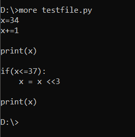
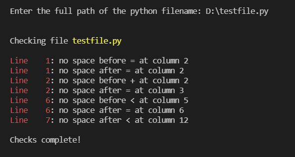

# Conform Python PEP

The purpose of this program is to suggest some of the PEP8 non-conformance in the python file

You might want to use this program if -
+ your editor does not support formatting
+ for some reason you don't like to use your editor's formatting
+ or, you want to try how this program works out for you


## Features

Some of the styles handled are -

+ Space around arithmetic, logical, comparison, and bitwise operators

+ Space after comment starts

+ No tabs to be used


## How to run

1. Clone the repository on your machine

2. Run the below command in the project directory

3. Compile with
   
   ```bash
   $ javac -sourcepath src -d bin src/App.java
   ```

4. Identify the `.py` file that you want to check. Provide its path when running the program
   
   ```bash
   $ java -cp bin App <path_to_python_file>
   ```

5. You can also run without supplying the path to python file as a command line argument, and supply it when the program prompts
   
   ```bash
   $ java -cp bin App
   ```


## Screenshots

+ Contents of `testfile.py`

   

+ Example of execution

   
