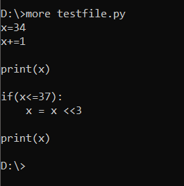
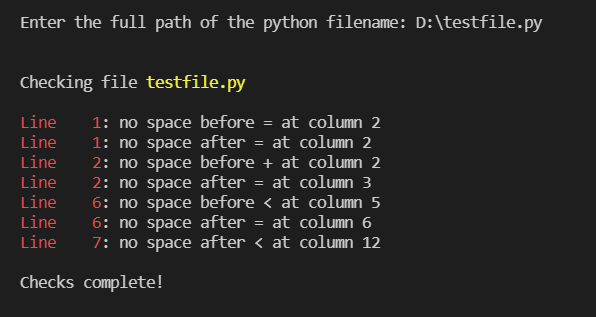

# Conform Python PEP

The purpose of this program is to suggest some of the PEP8 non-conformance in the python file


## When to use

- your editor does not support formatting
- for some reason you don't like to use your editor's formatting
- or, you want to try this program works out for you


## Styles handled

- space around arithmetic, logical, comparison, and bitwise operators
- space after comment starts
- no tabs to be used


## Running Locally

1. Clone this repository
1. Navigate inside the root folder
1. Compile with
   ```shell
   javac -sourcepath src/ -d bin/ src/App.java
   ```
1. Run with
   ```shell
   java -cp bin/ App <path_to_python_file>.py
   ```
1. You can also run without supplying the python file as a command line argument, and supply it when the program prompts
   ```shell
   java -cp bin/ App
   ```


## Screenshots

Contents of `testfile.py`




Example of execution




## Known Issues

- does not flag multiple spaces
- flags no-space in keyword arguments
